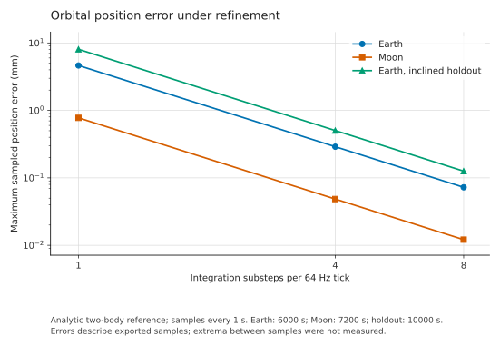

# 2207: Integer Spaceflight Simulator and SpaceFOM

2207: Integer Spaceflight Simulator is a deterministic orbital dynamics engine. Its authoritative state is integer, with explicit units, rounding rules and command order, so a scenario and its command history produce the same bytes on every machine we have tested, across instruction set architectures. This repository contains a small prototype that publishes the simulator's output through the SISO Space Reference FOM (SpaceFOM, SISO-STD-018-2020) over HLA, a verifier anyone can run, and the measurements behind the results below.

2207 is the project name; the scenarios are set in the year 2207. The simulator source is not included here.

This is a bounded interoperability prototype. We have not established full SpaceFOM compliance or operational navigation accuracy.

## Verify it yourself

Download the verifier package for your platform from the [release page](https://github.com/pennyleans/spaceFOM-integer/releases/tag/verify-9e44426), extract it and run `2207-verify` (`2207-verify.exe` on Windows). It reruns five orbital scenarios and a scripted session, hashes the complete state at every 64 Hz tick, and compares the result with the hashes recorded on our machines. A full run takes a few minutes; `--quick` takes under a minute.

`PASS` means your machine produced the same 1,497,350 states bit for bit as ours. It tests reproducibility, not correctness: accuracy is assessed separately against outside references (below). The verifier contains compiled simulator code, so it shows that the shipped program reproduces identically on your platform, not what the program does internally. `9e44426` in the package names is the start of the simulator source identity, a hash of its source files.

| Package | Status |
|---|---|
| `2207-verify-9e44426-win-x64.zip` | Full run passed from the release: AMD Ryzen 9 5900X, Windows 11 |
| `2207-verify-9e44426-osx-arm64.tar.gz` | Full run passed from the release: Apple M4, macOS 26.6.1 |
| `2207-verify-9e44426-linux-x64.tar.gz` | Full run passed from the release: Ubuntu 24.04 under WSL2 on the same AMD machine; the same source also passed on an Intel Xeon virtual machine |
| `2207-verify-9e44426-win-arm64.zip`, `-osx-x64.tar.gz`, `-linux-arm64.tar.gz` | Built, not yet run on hardware |

The packages are self-contained and need no .NET installation. They are not signed or notarized. Earlier evidence refers to the verifier by its former name, `iss-verify`. [How the arithmetic makes this possible](docs/report.md#integer-arithmetic).

## Results

### 1. Bit-identical state across architectures and operating systems

| Machine | Architecture | Operating system | Runtime |
|---|---|---|---|
| AMD Ryzen 9 5900X | x86-64 | Windows 11 | .NET 10.0.12 |
| Apple M4 | AArch64 | macOS | .NET 10.0.12 |
| Intel Xeon (virtual) | x86-64 | Ubuntu 24.04 | .NET 10.0.12, both the Ubuntu and the Microsoft build |

- **Physical state.** 1,496,325 per-tick digests of the complete physical state match on all three machines across five scenarios at the selected integration setting. A further 856,324 match between the first two machines at the baseline setting. Midpoint and endpoint snapshots match byte for byte.
- **Sessions.** All 1,025 records of a 16-second scripted session match byte for byte on all three, including guidance state and accepted translation, thrust, rotation and attitude commands. A new process restored from the midpoint snapshot reproduces the remaining 513 records exactly.
- **Exports.** The binary64 SpaceFOM recording exported on Linux is byte-identical to the one exported on Windows.

Each digest is a SHA-256 of the canonical state encoding. All three machines ran the same runtime version. The [report](docs/report.md#bit-identical-replay) gives the scope in full.

### 2. Numerical accuracy against outside references

We compared sampled trajectories with closed-form solutions and with two outside references, NASA GMAT R2026a and JPL Horizons.

- **GMAT.** At the baseline setting, matched GMAT runs agree with our closed-form Earth and Moon orbit solutions to within 1.2 µm and 0.23 µm, so the simulator's orbit errors, measured against those solutions, match its differences from GMAT to within that margin. For the finite burn, GMAT and the simulator agree to within 0.21 µm, which bounds the simulator's error but cannot resolve its sub-nanometre value.
- **Integration refinement.** Eight internal steps per 64 Hz tick reduce the maximum sampled orbital error by a factor of 64, consistent with the second-order convergence of the velocity Verlet integrator. An eccentric, inclined orbit held out of the selection gives a maximum error of 0.126 mm over 10,000 s.
- **Horizons.** A consistency check of initial conditions and model: over a 60-second multi-body coast, our 11-body point-mass model differs from JPL Horizons by at most 4.2 mm, a residual dominated by differences in initial states and models, not integration error.

### 3. Byte-exact HLA exchange

A publisher and an observer run as separate processes on the OpenRTI IEEE 1516-2010 runtime over loopback. They exchange a 60-second, 3,841-frame lunar coast through the SpaceFOM data model, including a coordinated freeze, resume and shutdown. The recording the observer reconstructs from RTI callbacks alone is byte-identical to the one the publisher sent, on Windows (MSVC) and Linux (GCC) with OpenRTI, and with Pitch pRTI Free 5.5.10, a two-federate edition. On OpenRTI, a third federate that joins after initialization receives the current ExCO on request, and the recording stays byte-identical. A federate built with NASA's TrickHLA 3.2.2, taking the observer's place on Pitch pRTI, completed the exchange through the freeze, resume and shutdown; every vessel and body update it subscribed to, 3,841 of each, matched the recording bit for bit. States are published on ICRF axes under the standard `SolarSystemBarycentricInertial` root. Malformed, incomplete and interrupted exchanges are refused without producing output.

On Pitch pRTI Free the federation also saves and restores through HLA: the Master saves at the midpoint, restores that save at three quarters, and all 960 frames the observer receives again after the restore match the first pass bit for bit.

## Reproduce

- **Replay:** the verifier packages above. To build them, see [docs/build.md](docs/build.md#verifier-packages).
- **HLA exchange:** extract `2207-spacefom-exchange-win-x64.zip` from the release and run `run-exchange.ps1`; success prints `byte_identity: True`. To build the adapter, including on Linux, see [docs/build.md](docs/build.md).
- **Accuracy:** reassess from the recorded observations with [qualification/precision64](qualification/precision64/README.md); rerun the closed-form, GMAT and Horizons comparisons with [qualification/reference](qualification/reference/README.md).
- **Recordings:** decode and compare with the separately written Python decoder in [qualification/wire](qualification/wire/README.md).

## Limitations

- The force model is mutual point-mass gravity for the Sun, the planets or planet systems, the Moon and Titan. Nonspherical gravity, small bodies, relativity and atmospheres are absent.
- Accuracy figures are maxima at one-second samples for the declared scenarios. They are not bounds between samples and do not describe arbitrary missions.
- SpaceFOM time stamps use a constant TDB-to-TT offset, described in the [federation profile](docs/federation-profile.md#time).
- The exchange passes on OpenRTI and Pitch pRTI Free and fails on Portico, which lacks a service our publisher uses. The Pitch results were obtained with the RTI restarted before each run; on long-lived Free sessions, runs failed with a time advance grant that arrived before every update for that tick, which we have not explained. TrickHLA ran only as a follower, on Pitch pRTI, subscribed to the root frame, the vessel and one body. Arbitrary mode changes and failure recovery are untested. HLA save and restore pass on Pitch pRTI between our own federates for one scripted case; TrickHLA's SpaceFOM mode does not support them. See the [interoperability reports](evidence/README.md).
- The prototype departs from SpaceFOM conventions in several places, listed in the [federation profile](docs/federation-profile.md#deviations-from-spacefom-conventions).
- Binary64 wire values are observations of the integer state and cannot restore a simulation session.

## How the work was done

We set the requirements and the acceptance thresholds and directed the work. The simulator, the adapter, the test tools and much of the documentation were written with AI coding agents, and the interoperability rounds were run by an agent on our machines, following written test plans. Its reports are kept as lab notes, with later corrections marked. The results do not rest on trusting that process: each claim cites a receipt or log, thresholds were declared before measurement, and the central result can be rerun with the verifier.

## Repository layout

| Path | Contents |
|---|---|
| `docs/` | [Report](docs/report.md), [federation profile](docs/federation-profile.md), [build instructions](docs/build.md) and figures |
| `verify/` | The replay verifier and its expected hashes |
| `native/spacefom/` | C++ HLA publisher and observer, and the [recording format](native/spacefom/README.md) |
| `qualification/` | [Declared thresholds, reference implementations and probe programs](qualification/README.md) |
| `evidence/` | Measured results, logs and file identities ([index](evidence/README.md)) |
| `tools/` | Build, packaging and integrity scripts |
| `fom/` | The five SpaceFOM modules used, unmodified |
| `data/` | Recordings and body catalogue |
| `manifest.json` | SHA-256 of every file, checked by `tools/validate-export.py` |

## Contact

Harriett Little, i64systems@proton.me

## Licence

The original material in this repository is licensed under the [Apache License 2.0](LICENSE); see [NOTICE](NOTICE). Third-party components keep their own terms, listed in [THIRD-PARTY-NOTICES.md](THIRD-PARTY-NOTICES.md). The verifier packages also contain compiled simulator code, which may be run unmodified to check the results; see [NOTICE](NOTICE).

This prototype targets the published 2020 SpaceFOM. It makes no claim about SpaceFOM version 2, whose development is described in [this presentation](https://ntrs.nasa.gov/citations/20260008222).
