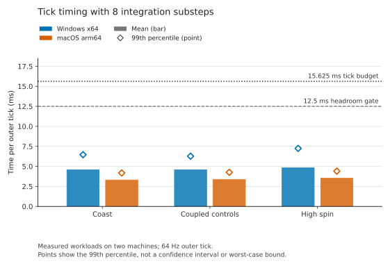

# Report

This report covers three separate claims about 2207: Integer Spaceflight Simulator: bit-identical replay across machines, numerical accuracy for declared scenarios, and byte-exact exchange over HLA. Each claim has its own evidence and limits, and none implies the others.

## Method

Pass thresholds were written down before each measurement, in [`qualification/contract.json`](../qualification/contract.json) for the baseline study and [`acceptance.json`](../qualification/precision64/reference/acceptance.json) for the refinement study. A failed attempt stayed failed; changing a threshold would have required a new, separately declared experiment. None was needed.

The simulator advances in 64 Hz command ticks. Within each tick it takes a fixed number of internal integration steps while one command is held. The baseline setting takes one internal step per tick; the selected setting takes eight. The setting is part of the simulation's identity: it enters saved state, replay and network compatibility checks, and it never changes with processor load.

The reference implementations used below were written from the published equations and the exported initial conditions, without access to the simulator source. They were built within our project and are not outside authorities. The outside references are NASA GMAT and JPL Horizons. Some receipt schema names and file names use "independent" in the narrower sense of a separately written implementation.

## Integer arithmetic

Authoritative state is held entirely in integers. Positions are whole millimetres plus a remainder in units of 1/32,768,000,000,000,000 mm, about 3e-20 m. Velocities are whole nanometres per second plus a remainder in units of 1/256,000,000 nm/s. Attitude is a fixed-point quaternion scaled by 2^60, and gravitational parameters are 128-bit integers in µm³/s². Gravity sums the contribution of every body in arbitrary-precision integer arithmetic: the cube of each separation uses an integer Newton square root, and each quotient rounds half to even to femtometres per second squared. Bodies are always processed in the same order, sorted by identifier. The integrator is fixed-step velocity Verlet (kick, drift, kick), with thrust evaluated at the midpoint attitude and mass. Overflow and out-of-range or invalid states stop the simulation with a fault; nothing wraps or clamps. The dynamics library contains no floating-point types or operations. Floating point appears only in derived display values, exported observations and test references, none of which feed back into the state. Because every operation is exact integer arithmetic with a defined rounding rule and order, the result is designed not to depend on the processor, operating system or compiler. It does depend on the runtime's arbitrary-precision integer implementation, and the circular-orbit scenarios take one binary64 square root at initialization (below). The replay tests check the result on real machines.

Scenarios:

| Scenario | Duration | Description |
|---|---:|---|
| Earth orbit | 6,000 s | Circular two-body orbit of radius 6,778.137 km, longer than one period |
| Moon orbit | 7,200 s | Circular two-body orbit of radius 1,837.4 km, longer than one period |
| Finite burn and coast | 120 s | 18,000 kg vessel, 1,000 N constant inertial thrust at 4,500 m/s exhaust velocity for 60 s, then 60 s coast |
| Multi-body lunar coast | 60 s | Vessel near the Moon with all 11 catalogue bodies |
| Eccentric inclined orbit | 10,000 s | Two-body Earth orbit with semi-major axis 10,000 km, eccentricity 0.30 and inclination 36.87°, starting at perigee; held out of the refinement selection |

## Bit-identical replay

The same scenarios ran on an AMD Ryzen 9 5900X under Windows 11 (x86-64) and an Apple M4 under macOS (AArch64), both on .NET 10.0.12. At every tick each machine recorded a SHA-256 digest of the canonical encoding of the complete physical state.

| Setting | Scenarios | Matching per-tick digests |
|---|---:|---:|
| Eight steps per tick | 5 | 1,496,325 |
| One step per tick | 4 | 856,324 |

Each scenario contributes 64 digests per simulated second plus the initial state. Midpoint and endpoint snapshots also match byte for byte. The decimal observation files differ only in platform line endings. [Receipt, eight steps](../evidence/precision64/cross-device-physical.json); [receipt, one step](../evidence/qualification/replay/cross-device.json).

A 16-second scripted session exercises translation, thrust, rotation, attitude hold, rotation damping and prograde guidance. All 1,025 canonical session records, covering physical state, guidance, parameters and accepted commands, match byte for byte across the two machines. On each machine a process writes the tick 512 snapshot, exits deliberately, and a new process restores it and reproduces the remaining 513 records exactly. [Receipt](../evidence/precision64/cross-device-session-final.json).

We later repeated the eight-step scenarios and the session on a third machine, an Intel Xeon virtual machine under Ubuntu 24.04 (x86-64), with two different builds of .NET 10.0.12: Ubuntu's source build and Microsoft's runtime distributed through NuGet. Every digest stream, snapshot and session record matched the published hashes. The verifier used for this run is the one we distribute; its source is in [`verify/`](../verify/) and it reuses the scenario definitions of the original probe. The two circular-orbit scenarios compute their initial speed once with a binary64 square root, which IEEE 754 requires to be correctly rounded, so the starting integers are the same everywhere. [Linux receipts](../evidence/linux/README.md). The released packages have since passed full runs on Windows 11 (x86-64), macOS 26.6.1 (AArch64) and Ubuntu 24.04 under WSL2 (x86-64). [Receipts](../evidence/interop/round8/REPORT.md).

On one machine, paired runs of each baseline scenario also compared the full snapshot bytes at every tick, including a branch restored from serialized midpoint bytes. Invalid attitude, duplicate identities, an invalid guidance target and truncated input are all refused, and the live session's encoding is unchanged after each refusal. [Replay evidence](../evidence/qualification/replay/README.md); [restore boundary](../evidence/qualification/boundary/README.md).

Bit identity covers the authoritative state only. Derived instrument displays are not part of it: after the high-spin timing run, the final canonical state hashes match, but the serialized display view was 16,290 bytes on x86-64 and 16,289 bytes on AArch64. [Receipt](../qualification/precision64/reference/high-spin-independent-v1.json).

Scope: three machines, two architectures, three operating systems and one runtime version, in two builds. ARM64 Windows and Linux, x86-64 macOS, other runtime versions, arbitrary command histories and interrupted writes were not tested. The per-tick digest streams are identified by hash in the receipts; the verifier regenerates them, and the simulator source is not included.

## Numerical accuracy

Errors are the maximum position difference from the reference over one-second samples. They are not bounds between samples.

| Scenario | Reference | One step (mm) | Eight steps (mm) |
|---|---|---:|---:|
| Earth orbit | Closed-form two-body | 4.6353 | 0.0724 |
| Moon orbit | Closed-form two-body | 0.77589 | 0.0121 |
| Finite burn and coast | Closed-form variable-mass rocket | 8.38e-7 | 1.31e-8 |
| Multi-body lunar coast | Refined 11-body RK4 | 3.15e-3 | 4.92e-5 |
| Eccentric inclined orbit, held out | Closed-form two-body | 8.0502 | 0.1258 |

The ratio between one and eight steps is 64 for each orbital case. Between four and eight steps it is 0.250 for position in both circular orbits. Both are consistent with second-order convergence. All declared absolute, refinement and mass gates pass. The gates are outer limits, 100 mm for orbital position, 10 mm for the burn and 1e-9 kg for mass, so passing them is a check against gross error; the measured values in the table are the result. Propellant mass matches the closed-form value exactly at every tested setting. [Eight-step receipt](../evidence/precision64/physics.json); [one-step receipts](../evidence/qualification/reference/final-v1/).

On the two circular orbits, specific energy and angular momentum computed from the exported states stay at the binary64 evaluation floor, about 7e-16, at every setting. This is expected: velocity Verlet's energy error depends on radius and speed, which are nearly constant on a circle, so these two cases cannot distinguish settings. On the eccentric orbit the maximum relative energy error is 5.3e-11, 3.3e-12 and 8.3e-13 at one, four and eight steps, the second-order scaling expected of velocity Verlet. Angular momentum stays at the evaluation floor on every orbit, because velocity Verlet conserves it exactly for central forces apart from integer rounding.

Unlike the simulator, the Python reference tools use the platform's floating-point math library and are not bit-reproducible across operating systems. Rerunning the eight-step assessment on Linux x86-64 reproduces every maximum error, gate and outcome in the Windows receipt exactly; the RMS fields differ by at most 6e-7 relative.

### Outside references

**NASA GMAT R2026a.** We ran the official console release with point-mass models matched to the Earth orbit, Moon orbit and finite burn scenarios at the baseline setting. GMAT agrees with our closed-form Earth and Moon solutions to within 1.20 µm and 0.232 µm, and with the simulator's finite-burn trajectory to within 0.206 µm in position and 2.5e-11 kg in mass. GMAT's bundled ephemerides do not reach 2207, so these isolated problems use a 2000 epoch and compare elapsed time and relative state only. GMAT was not rerun at the eight-step setting; those results rest on the same closed-form references. [GMAT evidence](../evidence/qualification/reference/README.md).

**JPL Horizons.** We retrieved barycentric ecliptic J2000 states for all 11 bodies at the scenario epoch and 60 s later, and kept the original responses. The scenario's initial body positions differ from Horizons by 0.02 mm to 0.76 mm. Propagated with our point-mass model, the largest difference from Horizons after 60 s is 4.2 mm in position and 0.11 mm/s in velocity, both for Uranus. This describes model differences, including the initial offsets, Horizons' richer dynamics and its output precision. It is not an integration error or a prediction uncertainty.

## Selecting the integration setting

We screened settings on the four nominal scenarios and CPU cost, chose a setting, then ran the held-out orbit at that setting, half of it and the baseline. The CPU gate required both the mean and the nearest-rank 99th percentile to stay at or below 12.5 ms, which is 80% of the 15.625 ms tick. Each row is 8,192 measured ticks after 1,024 warm-up ticks. The measured work includes all 11 bodies, session clone and restore, canonical serialization and SHA-256, and instrument-state serialization on every tick.

| Machine | Steps | Workload | Mean (ms) | p99 (ms) | Ticks over 15.625 ms |
|---|---:|---|---:|---:|---:|
| x86-64 | 8 | Coast | 4.572 | 6.464 | 0 |
| x86-64 | 8 | Coupled controls | 4.580 | 6.274 | 0 |
| x86-64 | 8 | High spin | 4.823 | 7.243 | 0 |
| x86-64 | 16 | Coast | 10.936 | 14.251 | 8 |
| x86-64 | 16 | Coupled controls | 9.855 | 13.814 | 3 |
| AArch64 | 8 | Coast | 3.299 | 4.177 | 0 |
| AArch64 | 8 | Coupled controls | 3.373 | 4.257 | 0 |
| AArch64 | 8 | High spin | 3.522 | 4.404 | 0 |
| AArch64 | 16 | Coast | 6.293 | 7.192 | 0 |
| AArch64 | 16 | Coupled controls | 6.414 | 7.321 | 0 |

Eight steps pass on both machines; sixteen fail the gate on x86-64. The high-spin workload uses a 14 rad/s principal-axis rotation. The 99th percentile is empirical, not a worst-case bound. Rendering, network waiting and diagnostic file writes are excluded. [Timing data](../evidence/precision64/timing/); [summary](../evidence/precision64/performance.json).

## HLA exchange

The adapter publishes a frozen recording through SpaceFOM on OpenRTI over TCP loopback. The publisher acts as Master, Pacing and Root Reference Frame Publisher; the observer is the required early joiner. Logical time is `HLAinteger64Time` in microseconds, with 15,625 µs per tick. The [federation profile](federation-profile.md) records frames, time and the execution subset.

| Test | Result |
|---|---|
| Normal exchange of the 3,841-frame, 5,316,325-byte lunar recording | Received bytes identical; SHA-256 `b83ad5e6…c56` |
| Required early observer delayed by 500 ms | Received bytes identical |
| Coordinated freeze at the midpoint, then run and shutdown | Logical time and state count do not advance while frozen |
| One body update omitted at tick 128 | Observer refuses the incomplete frame; no output written |
| Publisher or observer interrupted at tick 256 | No complete or partial output written |
| Existing output file | Refused before connecting; file unchanged |
| Revised eight-step recording | Received bytes identical |

The adapter was later built with GCC 13.3 on Linux x86-64 against the same pinned OpenRTI source. Unmodified, it reproduced the baseline recording's exchange byte for byte. We then moved the wire to ICRF axes (see the [federation profile](federation-profile.md#frames-and-attitude)); the eight-step ICRF recording, `data/published-icrf.sf`, also crossed the federation byte for byte. Its 46,092 states are exactly the rotated ecliptic states, and replaying it through the viewer's display model gives the same altitudes, speeds and orbit values as the ecliptic recording to within 2.3e-8 relative. [Linux exchange receipts](../evidence/linux/README.md).

The exchange also completed byte for byte on Pitch pRTI Free 5.5.10, a commercial RTI, with the federates on Linux and the RTI on Windows. Pitch is a second, independent RTI implementation. On Portico 2.2.0 it fails before initialization, because Portico's IEEE 1516e interface does not implement `getFederateHandle`, a service our publisher uses to wait for the observer. [Interoperability report](../evidence/interop/REPORT.md).

A SpaceFOM late joiner recognizes itself from the pending `initialization_completed` point, requests the ExCO, and waits for it. The publisher now answers such requests with the latest untagged ExCO, root frame and static attributes. With a probe that follows these steps on OpenRTI, the late joiner received both, and the observer's recording stayed byte-identical with the third federate present. With the previous publisher the root frame request went unanswered, which matches the stall we saw with NASA's TrickHLA as a late joiner. [Late-join evidence](../evidence/linux/README.md#late-joining).

In a two-federate run on Pitch pRTI Free, a federate built with NASA's TrickHLA 3.2.2 took the observer's place. It obtained the ExCO through the answer path, followed the run mode, and logged every state update it received: 1,913 for `orbital_vessel` and 1,914 for `body_10`. All fourteen fields of every update match the recording bit for bit. The run did not reach the freeze: the Master's freeze announcement had less than one tick of lead, and TrickHLA declines a freeze time it has already reached. The publisher now announces Master-scheduled freezes one second ahead. [Round 3 report](../evidence/interop/round3/REPORT.md).

In the next run TrickHLA joined as an early joiner and stopped at `root_frame_discovered`. Two steps of the SpaceFOM Master's initialization were missing from our publisher: the ExCO update that follows publication of the root frame (SISO-STD-018-2020 figure 7-6), and a repeat of the initial data after `prototype_metadata`, which TrickHLA's multiphase initialization waits for. With both added in a diagnostic build, TrickHLA completed the whole exchange: it followed the Master's freeze at 30 s, the resume and the shutdown, and every one of its 3,841 `orbital_vessel` and 3,841 `body_10` updates matched the recording in all fourteen fields. Both additions are now in the publisher. On OpenRTI the default, Master-scheduled and late-join exchanges remain byte-identical with our observer. The committed publisher then repeated the TrickHLA result on Pitch pRTI: every synchronization point, the freeze at 30 s, resume and shutdown, and all 7,682 updates bit for bit, with our observer's control runs byte-identical in both modes. [Round 4 report](../evidence/interop/round4/REPORT.md); [round 5 report](../evidence/interop/round5/REPORT.md); [current Linux runs](../evidence/linux/README.md#current-publisher).

We then added HLA save and restore. Each federate saves its own state as canonical little-endian bytes: the observer's is every frame received so far with its counters and ExCO view, 3,060,732 bytes at the midpoint. On Pitch pRTI the Master saved the federation at the midpoint freeze, ran on to three quarters, froze again and restored the save. Both federates reloaded their state, required it to re-encode to the saved bytes, and confirmed that the RTI's logical time matched it. The run then continued from the midpoint. Each of the 960 frames the observer received again after the restore equals the frame it received before the restore, bit for bit, and the final recording is byte-identical to the published one. A TrickHLA 3.2.2 federate received the save request but did not complete it: in that version only the IMSim execution control scheme supports HLA save and restore, not the SpaceFOM scheme. [Round 7 report](../evidence/interop/round7/REPORT.md); [saved-state round trip](../qualification/saverestore/README.md).

The interruption tests show that no bad output is written. They do not show graceful recovery: after an omitted update the publisher waited until the test deadline stopped it. [Wire results](../evidence/qualification/wire/RESULTS.md); [eight-step exchange](../evidence/precision64/transport/receipt.json).

A separate Python decoder, which uses only the standard library, checks every field of every frame and compares recordings bit for bit. Its author had read the adapter source, so it is a second implementation, not a blind one. After a first version failed to detect swapped quaternion labels, we added an asymmetric attitude with hand-derived expected values. The decoder now rejects label swaps, component swaps and a wrongly conjugated quaternion, and a production-encoded state matches the hand-derived values to within 1e-15. [Semantic tests](../evidence/qualification/wire/semantic-v1/RESULTS.md).

## Integration checks

At the eight-step setting, headless tests pass for two-process network agreement, ordered controls, refusal of a peer with a different setting, and orderly shutdown. The packaged Unreal viewer, which displays received state and cannot command the simulation, passes a headless start-up check. No new human network session or rendering measurement was made. [Regression logs](../evidence/precision64/regressions/); [viewer check](../evidence/precision64/unreal-canary.json).

## Corrections made during the work

Several first attempts failed. We recorded each failure, corrected the harness or the reference rather than the thresholds, and reran:

- The session regression found an integration setting missing from the list of saved state fields. The field was added and tested at every supported value.
- A diagnostic replay path assumed the old setting. It now loads the setting explicitly.
- The first multi-body reference lost precision in outer-planet coordinates. It now integrates deviations from each body's initial straight-line path.
- Early GMAT scripts had setup errors, including a default Earth gravity field silently added to the burn case. Corrected scripts passed.
- A log redactor in the wire harness shortened an `rti://` argument, and a restore probe's exception filter was too narrow. Both were fixed and rerun.
- A comparison script treated CRLF and LF line endings as a state mismatch. Observation files are now compared after newline normalization. Canonical state comparisons use exact bytes.

The raw logs of the failed attempts are not included.

## Limitations

- The force model is mutual point-mass gravity for the catalogue bodies. Jupiter and Neptune are system barycentres. The vessel does not perturb the bodies. Nonspherical gravity, small bodies, relativity and atmospheres are absent.
- Accuracy is established for the five declared scenarios at one-second samples, not for arbitrary missions or real-world navigation.
- The TDB-to-TT mapping on the wire is a constant-offset approximation.
- The exchange passes on OpenRTI and Pitch pRTI and fails on Portico. A NASA TrickHLA federate completed the exchange on Pitch pRTI Free through the freeze, resume and shutdown, as a follower subscribed to the root frame, the vessel and one body. TrickHLA as Master and more than one TrickHLA federate are untested. Full SpaceFOM compliance, arbitrary mode requests and network security remain untested. HLA save and restore are tested for one scripted case between our own federates on Pitch pRTI; OpenRTI does not implement them, and TrickHLA's SpaceFOM scheme does not support them.
- Transmitted source hashes are provenance, not authentication.
